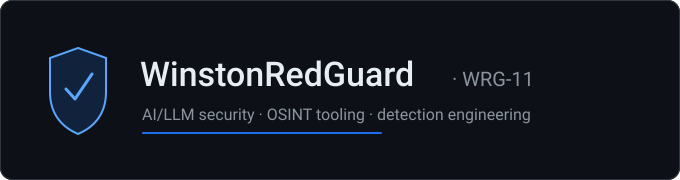
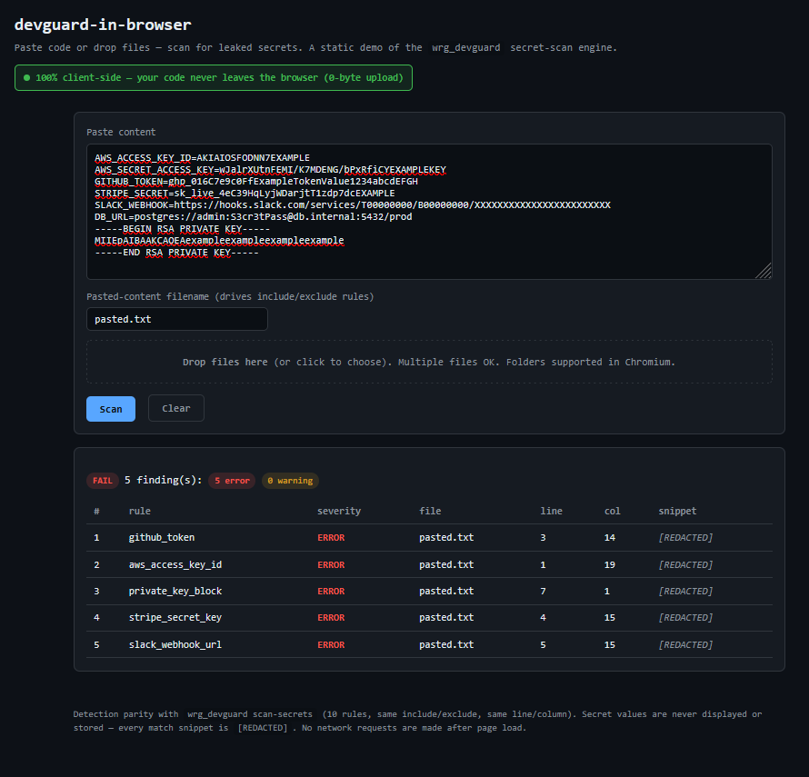

<strong>Pseudonymous solo research lab — AI/LLM security &amp; OSINT tooling</strong>

<em>Working artifacts, not promises. Everything open source under MIT.</em>

  
  
  
  

  <code>Python 3.12</code> · <code>Sigma</code> · <code>MCP</code> · <code>OSINT</code> · <code>MITRE ATT&amp;CK</code> · <code>Claude Code</code>

---

Solo researcher working on AI/LLM security, detection engineering, and OSINT tooling. I publish small, zero-dependency artifacts I actually use: vulnerable-by-design labs, a client-side secret scanner, Sigma detection content, and OSINT trust envelopes. Bug reports and detection rules occasionally land upstream.

### 🧪 Security labs & research

[**mcp-objauthz-lab**](https://github.com/WRG-11/mcp-objauthz-lab) &nbsp; 

Vulnerable-by-design MCP server for learning object-level / cross-tenant authorization (BOLA/IDOR) bugs + a hunt checklist.

[**ai-security-toolkit**](https://github.com/WRG-11/ai-security-toolkit) &nbsp; 

Offensive &amp; defensive AI/LLM security tools, labs, and CTF write-ups — zero-dependency Python.

### 🔍 Scanners

[**devguard-scan**](https://github.com/WRG-11/devguard-scan) &nbsp;  &nbsp; · &nbsp; [**▶ live demo**](https://wrg-11.github.io/devguard-scan/)

100% client-side secret scanner — paste code or drop files, nothing leaves your browser (zero upload).

### 📡 Detection / Sigma

[**wrg-sigma-rules**](https://github.com/WRG-11/wrg-sigma-rules) &nbsp; 

<!--SIGMA_RULES_START-->68<!--SIGMA_RULES_END--> sigma detection rules across 11 MITRE ATT&CK tactic categories — 0 benign false-positives; ships 3 MCP tools + 3 Claude Code skills.

### 🧭 OSINT & research

[**osint-trust-envelope**](https://github.com/WRG-11/osint-trust-envelope) &nbsp; 

Per-source epistemic ceilings for OSINT results — honest verified / inferred / heuristic / unverified envelopes; zero-dependency Python.

---

### 🔗 Upstream contributions

Detection content merged into community projects:

- [**nuclei-templates #16333**](https://github.com/projectdiscovery/nuclei-templates/pull/16333) — Milvus CVE-2026-26190 detection template
- [**nuclei-templates #16346**](https://github.com/projectdiscovery/nuclei-templates/pull/16346) — changedetection.io CVE-2026-25527 detection template

---

<code>0 / <!--SIGMA_RULES_START-->68<!--SIGMA_RULES_END--> benign sigma false-positives</code> · <code>0 CodeQL alerts</code> · <code>MIT across the ecosystem</code> · <code>zero-dependency Python where it makes sense</code>

